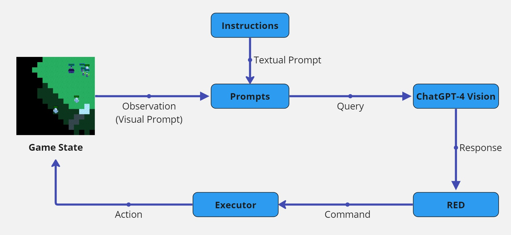
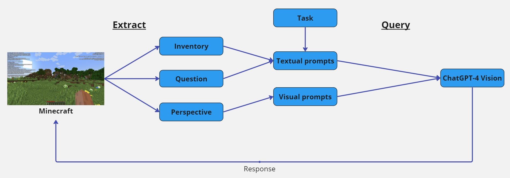

# Using ChatGPT to Play Video Games

## Abstract
Recent advancements in Natural Language Processing have led to the advent of Large Language Models (LLMs) being implemented in systems we interact with daily. While these models provide useful information, studies have shown that responses generated by them contain a certain level of inaccuracies. This makes us question the reasoning capabilities of these language models and to what extent the information presented by them is accurate. In this project, I incorporate a state-of-the-art model, GPT-4V, into two video game environments, MiniRTS and Minecraft. The project's main objective is to assess GPT-4V’s ability to generate logical, accurate, contextualised responses. GPT-4V is asked to play MiniRTS by generating natural language instructions while prompted to provide assistive suggestions to players’ queries in Minecraft. I conducted a qualitative analysis in both games and additionally carried out a user study in Minecraft to evaluate game performance and the generated responses. The experimental results indicate that GPT-4V struggles to generate logical and strategic responses in long gameplay. Furthermore, the responses are generally accurate but are subject to imprecision and inconsistency, particularly in lengthy answers. GPT-4V also shows significant effort in considering prompts but fails to show a deep understanding of them. Lastly, compared to existing studies, GPT-4V performs relatively weakly in generating responses in real-time. The study ends by highlighting the strengths and weaknesses of GPT-4V. It is hoped that further studies will address these limitations and advance the capabilities of LLMs.

## Overview
<ul>
  <li>Design</li>
  <li>Implementation</li>
  <li>Evaluation</li>
  <li>Results</li>
</ul>

## Design
For this study, GPT-4V has been chosen to be incorporated into MiniRTS and Minecraft for experiments.

MiniRTS is a simplified version of the Real-Time Strategy game genre, in which players are required to analyse the current game environment through images and inform the game about the next step with textual instructions. In this study, I have adopted the MiniRTS environment proposed by H. Hu et al. [[1]] The goal of MiniRTS is to defeat the enemies in red and destroy red's base. MiniRTS provides a simple but stochastic environment and incorporates both visual and textual information, allowing me to put GPT-4V's reasoning capabilities to the test. 

Minecraft is a sandbox game, offering a vast and dynamic environment with high diversity and customisability for evaluation. Minecraft utilises visual cues in a 3D environment, players will have to identify each block and entity to progress in tasks. Moreover, it also utilises textual information such as coordinates and biome. Through experiments, I can measure to what extent GPT-4V generates accurate and succinct information.      

## Implementation
There are 2 types of prompts in MiniRTS: Visual and Textual. When a MiniRTS game starts, it randomly populates the environment with resources and the location of the opponent's base. An image representing the current game state is captured and combined with texts illustrating the objective, game specifications and 10 example commands. These components are merged into a payload and are sent to GPT-4V as a query. The response acts as a command that is passed into a command-enforcing algorithm proposed by [[2]], which is later fed back into the executor to update the game state. The purpose of including example commands is the use of In-Context Learning, which gives the model insights that help the model to return responses more accurately, or in my case, in the desired format.

There are also 2 types of prompts in Minecraft. The model is asked questions regarding the game and to return suggestions or advice to assist the player. Upon querying, the player's perspective is captured as an image while the question and the player's inventory are captured as texts. These prompts make up the prompt and are sent to GPT-4V for the requested type of response. 

The communication between the games and GPT-4V is made possible with the GPT-4 API. Specifically for Minecraft, as there is no API support for Java, a Minecraft mod with TCP sockets between the Java client (Minecraft) and the Python server is used to enable communication between the endpoint and client. 

## Evaluation
In MiniRTS, both qualitative and quantitive analyses are performed to evaluate the reasoning capability of GPT-4V. Throughout the experiment, the average win rate is calculated by recording the outcome of each MiniRTS game. Regarding instructions generated, metrics such as the average length of responses and the average number of instructions used in each game are recorded. Moreover, the instruction set is carefully analysed to discover any underlying possible patterns and strategies used.

In Minecraft, GPT-4V's ability to reason is assessed through 8 Minecraft tasks. Each task presents a different scenario and problem for the model to reason about. Each task is run 3 times to assess the ability to produce accurate responses consistently. These tasks include:

<ol>
  <li>Crafting recipe</li>
  <li>Non-existing items</li>
  <li>Mob identification</li>
  <li>Resources management</li>
  <li>Step-by-step guide</li>
  <li>Suggestions for random events</li>
  <li>Navigating through terrain</li>
  <li>Navigating through obstacles</li>
</ol>

Furthermore, besides a qualitative analysis of the generated responses, a between-subject user study is also conducted to evaluate the usefulness of responses generated by GPT-4V and its ability to improve based on user feedback. The first group of participants are asked to complete the first survey (without any feedback). Their feedback is incorporated into the model to generate the responses for the second survey. A different group of participants are then asked to complete the second survey without notifying them of the improvements made. Each question is rated on a scale of 1 to 5, with 1 indicating the response was not useful at all and 5 indicating the response was extremely useful.

## Results
30 MiniRTS games were run and the outcomes have been recorded. GPT-4V have won 5 games in total, resulting in a win rate of 16.7%. The average number of words per instruction in a game is 4.66, with a total of 99.3 instructions across 30 games. The average time required to generate an instruction is 3.165 seconds.

The most frequently used words across the 30 games are as follows: 

| Word       | Frequency | Word percentage (%) |
|------------|-----------|---------------------|
| unit       | 1939      | 17.734              |
| scout      | 1420      | 12.987              |
| attack     | 974       | 8.908               |
| red        | 867       | 7.929               |
| enemy      | 784       | 7.170               |
| nearest    | 585       | 5.350               |
| northeast  | 415       | 3.796               |
| north      | 374       | 3.421               |
| one        | 261       | 2.387               |
| building   | 256       | 2.341               |

A summary of GPT-4V's performance in Minecraft tasks is as follows:
<ol>
  <li>Crafting recipe: 2/3 of responses are correct while the remaining yields a wrong crafting recipe.</li>
  <li>Non-existing items: 3/3 of responses correctly stated that there are no such tools in the game.</li>
  <li>Mob identification: 1/3 of responses correctly identify all mobs while the remaining have wrong classifications.</li>
  <li>Resources management: 3/3 of responses gave the player a detailed list of items that they should gather before an adventure.</li>
  <li>Step-by-step guide: 3/3 of responses responded with a step-by-step guide to obtain elytra, with 1/3 of responses misinterpreting the player's location in the end.</li>
  <li>Suggestions for random events: 0/3 of responses can produce a list of suggestions for obtaining a specific enchantment in Minecraft.</li>
  <li>Navigating through terrain: 2/3 of responses fail to generate a precise guide to assist the player in navigating out of the nether. 1/3 of the responses did not give an effective response. </li>
  <li>Navigating through obstacles: 3/3 of responses generated a step-by-step guide to deal with each obstacle based on priorities.</li>
</ol>

Rating from 10 respondents before prompt refinement (No use:1, Very useful: 5):
| Task Description                  | Rating |
|-----------------------------------|--------|
| Resources management              | 3.6    |
| Step-by-step guide                | 3.3    |
| Suggestions for random event      | 3.3    |
| Navigating through terrain        | 3.4    |
| Navigating through obstacles      | 4.1    |

Rating from 10 different respondents before prompt refinement (No use:1, Very useful: 5):
| Task Description                  | Rating |
|-----------------------------------|--------|
| Resources management              | 4.1    |
| Step-by-step guide                | 3.6    |
| Suggestions for random event      | 3.6    |
| Navigating through terrain        | 4.1    |
| Navigating through obstacles      | 4.5    |

[1]:https://arxiv.org/abs/1906.00744
[2]:https://proceedings.neurips.cc/paper_files/paper/2022/file/318f3ae8be3c97cb7555e1c932f472a1-Paper-Conference.pdf
